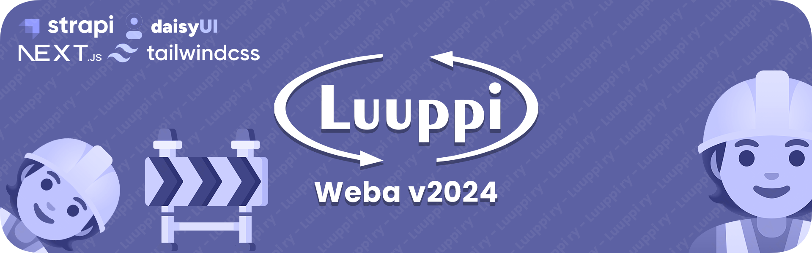

# [Luuppi ry - Weba](https://luuppi.fi)

[Luuppi ry](https://luuppi.fi) is the subject association for students studying mathematics, statistical data analysis, and computer science at Tampere University. Since 1969, Luuppi has been actively promoting the interests of its members and organizing a variety of free-time activities. It proudly holds the distinction of being the largest subject association at the [University of Tampere](https://www.tuni.fi/en)!

## About this Repository

This repository is the foundation of [luuppi.fi](https://luuppi.fi) website. It contains two main components: a Content Management System (CMS) powered by [Strapi](https://strapi.io/), and the website's frontend built using [Next.js](https://nextjs.org/). This project is led by Luuppi's **WWW / IT representatives**, who are elected annually through a voting process. If you have any questions about the repository, you can contact the team at **webmaster@luuppi.fi**.

## Development setup

### Frontend (_next_)

> [!IMPORTANT]
> The frontend content is primarily fetched from the CMS. Therefore, when developing the frontend, you should work with an instance of the CMS. If you are solely focused on frontend development without modifying the CMS logic, you can even use the production instance for this purpose. To make this adjustment, you can change the `NEXT_PUBLIC_STRAPI_BASE_URL` inside `next/.env.local`.

**Note:** The following commands should be executed within the `next` folder.

#### Prerequisites

Before you begin, ensure you have the following prerequisites installed on your system:

-   [Node.js](https://nodejs.org/en) (Version >= v20.xx)

#### 1. Configure `.env.local`

First, fill in the configuration file `.env.local`. You can use `example.env` as a reference.

#### 2. Install Dependencies

Run the following command to install project dependencies:

```bash
npm i
```

#### 3. Start the Development Server

Launch the development server by running the following command:

```bash
npm run dev
```

The development server should now be up and running at [http://localhost:3000](http://localhost:3000).

### CMS (_strapi_)

Strapi doesn't necessitate extensive coding. Initially, Strapi is bootstrapped using a CLI command. Subsequent 'development' mainly involves running a local instance and utilizing the content-type builder, which allows for local file changes. These changes can later be pushed to the remote server. Importantly, making modifications with the content-type builder can only be performed in the development environment; it's restricted in the production environment.

In summary, you use the content-type builder locally to structure the correct 'data models.' Once you've finished your work, you can push the changes to the remote server and switch to production mode.

<br>

> [!IMPORTANT]
> When modifying content in Strapi, update the newly generated types on the frontend by running `copyTypes.js` in the project's root. This action will copy the Strapi-generated types to the frontend.

**Note:** The following commands should be executed within the `strapi` folder.

#### Prerequisites

Before you begin, ensure you have the following prerequisites installed on your system:

-   [Node.js](https://nodejs.org/en) (Version >= v20.xx)

#### 1. Configure `.env`

First, fill in the configuration file `.env`. You can use `example.env` as a reference.

#### 2. Install Dependencies

Run the following command to install project dependencies:

```bash
npm i
```

#### 3. Start the Development Server

Launch the development server by running the following command:

```bash
npm run dev
```

The development server should now be up and running at [http://localhost:1337](http://localhost:1337).

## Contribution
We encourage you to contribute to making the weba™️ better! Please refer to the [Contributing Guidelines](.github/CONTRIBUTING.md) for instructions on how to proceed.

Trying to report a possible security vulnerability in this repository? Please
check out our [Security Policy](.github/SECURITY.md) for
guidelines about how to proceed.

## Contributors ♥️ Thanks

We extend our gratitude to all those who take the time to improve Luuppi's website. The main goal of this project being open-source is to enable everyone to be part of it and, most importantly, to learn from a "real project" with a very low threshold.

<br/>

<a href="https://github.com/luuppiry/luuppi-next/graphs/contributors">
  
</a>


## License
This repository is released under the [MIT License](https://opensource.org/licenses/MIT).
